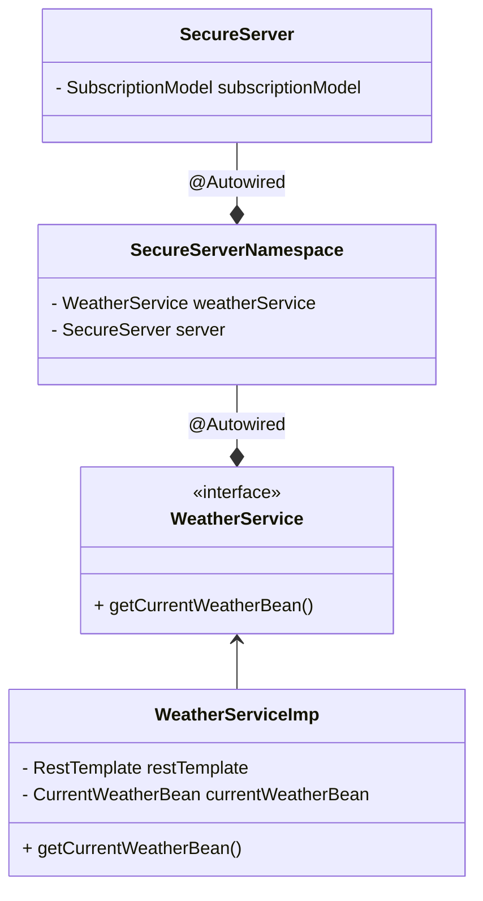

# Opc Server with Milo and Spring Boot
> Documentazione di progetto per la materia Informatica Industriale
<!-- TOC depthFrom:2 -->

- [Introduzione](#introduzione)
- [Perché Spring Boot](#perché-spring-boot)
- [Descrizione del progetto](#descrizione-del-progetto)
    - [Secure Server @Component](#secure-server-component)
    - [Strumenti utilizzati](#strumenti-utilizzati)
- [Funzionamento](#funzionamento)
- [Annex 1: GitHub](#annex-1-github)
    - [Step1: Creare il progetto su github](#step1-creare-il-progetto-su-github)
    - [Step2: Readme and .gitignore](#step2-readme-and-gitignore)
    - [Step3: Repo Download](#step3-repo-download)
- [Annex 2: Camel Demo with Spring Boot](#annex-2-camel-demo-with-spring-boot)
    - [Step1: Spring Init](#step1-spring-init)
    - [Step2: Importare il progetto Maven dentro Eclipse](#step2-importare-il-progetto-maven-dentro-eclipse)
    - [Step3: Apache Milo](#step3-apache-milo)

<!-- /TOC -->
<div style="page-break-after: always;"></div>

## Introduzione
La presente documentazione descrive come poter implementare un Server Opc utilizzando come standard SDK per implementare lo stack protocollare [Eclipse Milo](https://github.com/eclipse/milo). 

Nell'ambito del corso di Informatica Industriale è stato richiesto di sviluppare un Server OpcUa. 

Il server opc deve soddisfare le seguenti caratteristiche:
- Implementare diversi meccanismi di security
- Implementare delle funzionalità interessanti

Al fine di rispettare i requisiti di cui sopra si è scelto di implementare un server con le seguenti caratteristiche:
- Diversi endpoint con il supporto ai certificati
- Implementazione del meccanismo di autenticazione
- Implementazione di un servizio che prenda i dati da [OpenWeater](https://openweathermap.org/)
> :information_source: [OpenWeater](https://openweathermap.org/) è un servizio on line che permette previa registrazione di utilizzare API atte a fornire informazioni meteo il servizio è gratuito se si rispettano alcuni limiti, per ulteriori informazioni -> [OpenWeater Price](https://openweathermap.org/price)

L'idea di questo progetto è quella di implementare il server Opc utilizzando [Spring Boot](https://spring.io/projects/spring-boot), un framework di sviluppo molto diffuso anche in ambito java enterprise.


## Perché Spring Boot
Spring Boot rappresenta un framework che aiuta lo sviluppatore ad implementare automaticamente dei pattern architetturali durante lo sviluppo del progetto. 
> :white_check_mark: Spring è uno dei framework più utilizzati in abito enterprise. Uno degli obiettivi di questo progetto è fornire una facile implementazione dello Stack OPC UA utilizzando Eclipse Milo, allo scopo di far vedere come chi utilizzi questo Framework possa aggiungere questo stack alla lista dei servizi esposti. 

Capo saldo di Spring Boot e più in generale di Spring framework è il concetto dell'IoC (Inversion of control). Il framework definisce quello che si chiama IoC Container, l'IoC Container rappresenta un'area nella quale vengono istanziati gli oggetti del progetto. Gli oggetti che si trovano all'interno del Container vengono istanziati automaticamente utilizzando di default il pattern Singleton evitando così la proliferazione di oggetti nel heap-space di java. Tutti gli oggetti definiti nel Container sono disponibili per essere utilizzati dagli altri oggetti del sistema, in pratica ogni oggetto potrà utilizzare gli altri senza doverli costruire il tutto facilitato dall'annotazione `@Autowire`. 

Nel corso di questo documento verranno mostrati quali siano i vantaggi nell'usare questo tipo di framework, tali vantaggi verranno evidenziati dall'icona :white_check_mark:.

Questa documentazione non ha come obiettivo la descrizione dettagliata del framework, per maggiori informazioni consultare la documentazione ufficiale.

## Descrizione del progetto
Da un punto di vista logico il progetto si compone da un insieme di oggetti che vengono creati all'interno dell'IoC container di Spring. Gli oggetti che vengono istanziati sono gestiti *automaticamente* da Spring.
> :white_check_mark: Spring Istanzia automaticamente tutto gli oggetti utilizzando il pattern **SINGLETON** evitando così la proliferazione incontrollata degli oggetti

I principali aggetti che verranno messi nell'IoC container sono:


### Secure Server @Component

Il progetto si struttura in diverse cartelle in accordo alla seguente struttura: 
```
spring-camel-milo-server
	├── dist
	├── doc
	├── opccamelserver
	└── opcserver
```

dove:
- dist: contiene l'eseguibile di questo progetto, dentro la cartella è presente una descrizione per far partire il progetto.
- doc: contiene i sorgenti della documentazione.
- opccamelserver: contiene un server Opc di esempio utilizzando Apache Camel come descritto nell'[Annex 2](#annex-2-camel-demo-with-spring-boot).
- opcserver: contenente il progetto java oggetto della presente documentazione.


### Strumenti utilizzati

- Java SE 9
- Maven
- Eclipse with Spring tool suite
- [Spring initializr](https://start.spring.io/)


## Funzionamento
//TODO

<div style="page-break-after: always;"></div>

## Annex 1: GitHub

### Step1: Creare il progetto su github


### Step2: Readme and .gitignore

Aggiungere Readme e .gitignore

Come template del .gitignore è stato scelto Maven.


### Step3: Repo Download
Creare il repository e clonarlo in locale con il programma preferito di gestione del git.

<div style="page-break-after: always;"></div>

## Annex 2: Camel Demo with Spring Boot
Prerequisiti: 
- Java 9+ 
- Eclipse per j2ee con Spring Tools Suite Plugin installato

### Step1: Spring Init
Per inizializzare il progetto utilizzeremo Spring Initializr 

[Go to Spring initializr](https://start.spring.io/)

Inizializzare il progetto in accordo alla seguente immagine


Per inizializzare il progetto abbiamo utilizzato le seguenti configurazioni:
- Maven: Utilizzeremo Maven per compilare il progetto
- Spring Boot 2.3.0: Versione Stable di Spring Boot al momento di questo tutorial
- Packaging Jar: Si vuole realizzare un'applicazione standalone
- Java 11: Apache Camel Milo richiede Java 9+
- Dependencies Spring Boot DevTools: dipendenza utile durante lo sviluppo

A questo punto è possibile scaricare il progetto cliccando sul tasto GENERATE.
Una volta scaricato il progetto è stato copiato nella root del repository e decompattato.

### Step2: Importare il progetto Maven dentro Eclipse

Per importare il progetto i passi sono:

1. Aprire Eclipse 
1. Cliccare su File->Import... e selezionare Existing Maven Project 

1. Selezionare la cartella dove risiede il progetto e cliccare su Finish

A questo punto il progetto dovrebbe presentarsi nel seguente modo:


### Step3: Apache Milo
In questo step aggiungeremo le librerie Apache Camel Milo.

1. Apriamo il file `pom.xml`
1. Aggiungiamo la seguente dipendenza al file
```Xml
<dependency>
	<groupId>org.apache.camel.springboot</groupId>
	<artifactId>camel-milo-starter</artifactId>
	<version>${camel.milo.version}</version>
	<!-- use the same version as your Camel core version -->
</dependency> 
```
> La versione di Camel viene inserita nella sezione `<properties>` del `pom.xml` `<camel.milo.version>3.0.0</camel.milo.version>`

---
@Copiright [Cristina Lombardo](https://github.com/cristinalombardo/) / [License](/LICENSE)