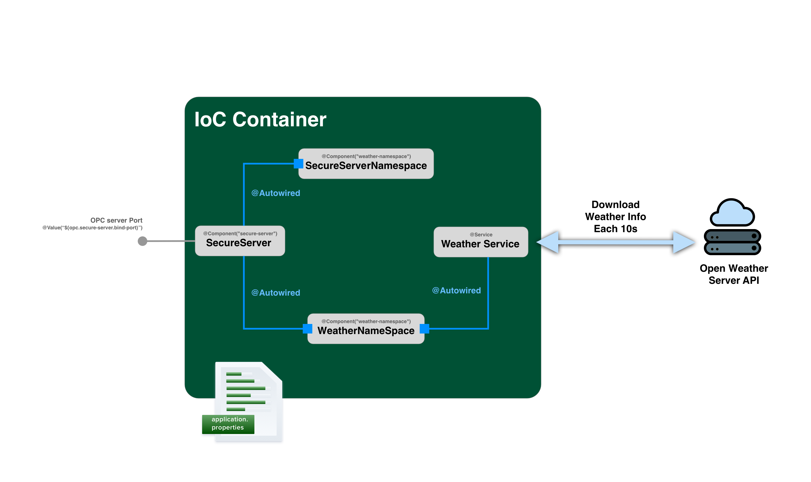
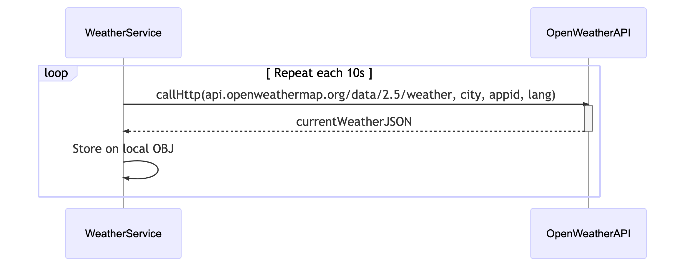
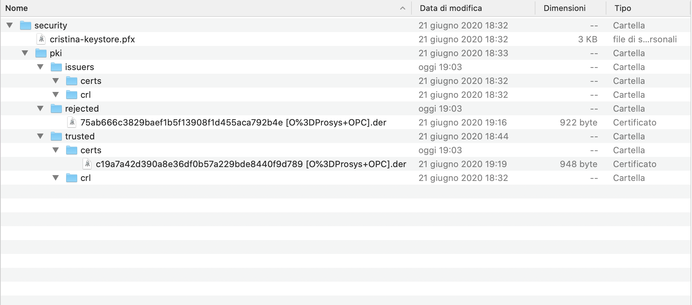
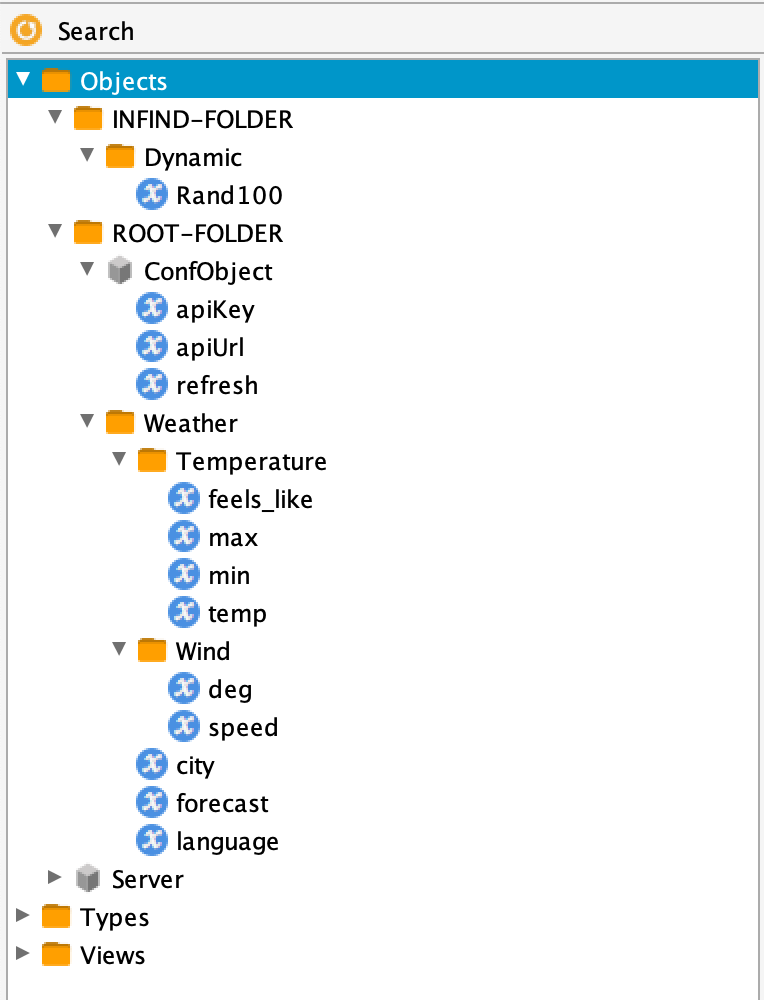

Opc Server with Milo and Spring Boot
=

> Documentazione di progetto per la materia Informatica Industriale

<!-- TOC -->

- [Introduzione](#introduzione)
- [Perché Spring Boot](#perché-spring-boot)
- [Descrizione del progetto](#descrizione-del-progetto)
    - [WeatherService](#weatherservice)
    - [SecureServer](#secureserver)
        - [Gestione dei certificati](#gestione-dei-certificati)
        - [Gestione degli endpoint](#gestione-degli-endpoint)
    - [Dati esposti dal server](#dati-esposti-dal-server)
    - [Weather namespace](#weather-namespace)
        - [Variabile language](#variabile-language)
        - [Current temperature](#current-temperature)
- [Conclusioni](#conclusioni)
- [Annex 1: Quick Start Guide](#annex-1-quick-start-guide)
    - [Requirements](#requirements)
    - [Build the project](#build-the-project)
    - [Run The project](#run-the-project)

<!-- /TOC -->
<div style="page-break-after: always;"></div>

# Introduzione
La presente documentazione descrive come poter implementare un Server Opc utilizzando come standard SDK per implementare lo stack protocollare [Eclipse Milo](https://github.com/eclipse/milo). . Se si volesse capire come far partire il progetto è possible andare direttamente alla seguente sezione [Annex 1: Quick Start Guide](#annex-1-quick-start-guide).

Nell'ambito del corso di Informatica Industriale è stato richiesto di sviluppare un Server OpcUa. 

Il server opc deve soddisfare le seguenti caratteristiche:
- Implementare diversi meccanismi di security
- Implementare delle funzionalità interessanti

Al fine di rispettare i requisiti di cui sopra si è scelto di implementare un server con le seguenti caratteristiche:
- Diversi endpoint con il supporto ai certificati
- Implementazione del meccanismo di autenticazione
- Implementazione di un servizio che prenda i dati da [OpenWeater](https://openweathermap.org/)

> Il comportamento del presente progetto è descritto nel seguente video [https://youtu.be/SCR9I5awd2A](https://youtu.be/SCR9I5awd2A)

> :information_source: [OpenWeater](https://openweathermap.org/) è un servizio on line che permette previa registrazione di utilizzare API atte a fornire informazioni meteo, il servizio è gratuito se si rispettano alcuni limiti, per ulteriori informazioni -> [OpenWeater Price](https://openweathermap.org/price)

L'idea di questo progetto è quella di implementare il server OpcUA con Milo SDK ed utilizzando [Spring Boot](https://spring.io/projects/spring-boot), un framework di sviluppo molto diffuso anche in ambito java enterprise.


# Perché Spring Boot
Spring Boot rappresenta un framework che aiuta lo sviluppatore ad implementare automaticamente dei pattern architetturali durante lo sviluppo del progetto. 

> :white_check_mark: Spring è uno dei framework più utilizzati in abito enterprise. Uno degli obiettivi di questo progetto è fornire una facile implementazione dello Stack OPC UA utilizzando Eclipse Milo, allo scopo di far vedere come chi utilizzi questo Framework possa aggiungere questo stack alla lista dei servizi esposti. 

Capo saldo di Spring Boot e più in generale di Spring framework è il concetto dell'IoC (Inversion of control). Il framework definisce quello che si chiama IoC Container, l'IoC Container rappresenta un'area nella quale vengono istanziati gli oggetti del progetto. Gli oggetti che si trovano all'interno del Container vengono istanziati automaticamente utilizzando di default il pattern Singleton evitando così la proliferazione di oggetti nel heap-space di java. Tutti gli oggetti definiti nel Container sono disponibili per essere utilizzati dagli altri oggetti del sistema, in pratica ogni oggetto potrà utilizzare gli altri senza doverli costruire il tutto facilitato dall'annotazione `@Autowired`. 

Nel corso di questo documento verranno mostrati quali siano i vantaggi nell'usare questo tipo di framework, tali vantaggi verranno evidenziati dall'icona :white_check_mark:.

Questa documentazione non ha come obiettivo la descrizione dettagliata del framework, per maggiori informazioni consultare la documentazione ufficiale.

# Descrizione del progetto
Da un punto di vista logico il progetto si compone da un insieme di oggetti che vengono creati all'interno dell'IoC container di Spring. Gli oggetti che vengono istanziati sono gestiti *automaticamente* da Spring.
> :white_check_mark: Spring istanzia automaticamente tutti gli oggetti utilizzando di defaul il pattern **SINGLETON** evitando così la proliferazione incontrollata degli oggetti (è possible cambiare il pattern generazionale da Singleton a Prototype qual ora fosse necessario)

I principali oggetti che verranno messi nell'IoC container sono:



<div style="page-break-after: always;"></div>

Il sistema quindi si compone dai seguenti elementi:



L'immagine sopra mostra la struttura del sistema. In dettaglio vengono descritti i componenti atti a gestire il sistema che sono:
- WeatherService
- SecureServer
- SecureServerNamespace
- WeatherNamespace

Nel seguito dettaglieremo tutti questi componenti.

<div style="page-break-after: always;"></div>

## WeatherService

L'oggetto WeatherService si compone di due elementi, un'interfaccia che definisce le azioni che vengono fatte dal WeatherService e un'implementazione dell'interfaccia che si chiama `WeatherServiceImp`.

L'implementazione è annotata con l'annotazione `@Service` che indica a Spring che tale oggetto va istanziato nell'IoC Container.

L'istanziazione del servizio passa attraverso il costruttore al quale iniettiamo dei paramatri che provengono dall'`application.properties` di Spring Boot.

```Java
@Service
public class WeatherServiceImp implements WeatherService{

	//{... Attributes section}

	public WeatherServiceImp(	
			@Value("${weather.apiurl}") String apiurl, 
			@Value("${weather.apikey}") String weatherApikey, 
			@Value("${weather.city}") String city, 
			@Value("${weather.lang}") String lang 
			) {
		super();

		this.weatherApikey = weatherApikey;
		this.apiUrl = apiurl;
		this.lang = lang;
		this.city = city;
		
		this.createOrRefreshCompleteUrl();
		//Initialize Rest Template
		this.restTemplate = new RestTemplate();
	}
	// {... Methods section}
}
```
La classe di cui sopra, annotata come `@Service`, prevede un costruttore con 4 parametri tali parametri vengono presi dal file di properties utilizzando l'annotazione `@Value`.

> :white_check_mark: All'interno del costruttore è mostrata l'inizializzazione dell'attributo `restTemplate` di tipo `RestTemplate`. Il RestTemplate è un classe Spring che permette di effettuare in maniera semplice le chiamate Http su API esterne. 

<div style="page-break-after: always;"></div>

Le azioni che deve implementare il WaterService sono sintetizzate nel seguente sequence diagram:



In particolare il servizio utilizza l'API [http://api.openweathermap.org/data/2.5/weather](http://api.openweathermap.org/data/2.5/weather) che prende i seguenti parametri all'interno del query string:
- `q` : query contente la città della quale si vogliono avere le informazioni
- `appid` : parametro nel quale specificare un apikey ottenibile registrandosi al servizio OpenWeather
- `lang` : parametro opzionale che permette di ottenere la frase relativa le previsioni in tutte le lingue specificando il codice della nazione (e.g. zh_CN per cinese, de per tedesco e così via)

All'interno del servizio la url con i parametri viene creata nel seguente metodo

```Java
private void createOrRefreshCompleteUrl() {
	//Define the remote weather url to call
	UriComponentsBuilder builder = UriComponentsBuilder
			.fromHttpUrl(this.apiUrl)
			.queryParam("q", city)
			.queryParam("appid", weatherApikey)
			.queryParam("lang", lang);
	this.apiCompleteUrl = builder.toUriString();
}
```
L'`UriComponentsBuilder` utilizza gli attributi di classe per generare una url che srà quindi nel formato

```
http://api.openweathermap.org/data/2.5/weather?q=Catania,it&appid=<your-API-key>&lang=en
```
Per effettuare le chiamate ogni X secondi viene utilizzato lo **schedulatore** di Spring.

> :white_check_mark: Spring fornisce un meccanismo di scheduling che permette facilmente di implementare attività periodiche basate su intervalli fissi (`fixedRate`), ritardo fisso (`fixedDelay`) o cron expression (`cron`) tali valori possono anche essere letti dall'application.properties dopo la compilazione.

L'attività schedulata che effettua le chiamate è implementata dal seguente metodo.

```Java
@Scheduled(fixedRateString = "${weather.callinterval}")
public void refreshCurrentWeatherBean() {
	/**
	 * Get the data from URL, 
	 * mapping the response on class CurrentWeatherBean, 
	 * store on local attribute currentWeatherBean
	 * */
	this.currentWeatherBean = 
		this.restTemplate.getForObject(
			this.apiCompleteUrl, 
			WeatherBean.class);

	logger.info("\nCall: " + this.apiCompleteUrl  + 
	"\nResponse -> " + this.currentWeatherBean);
}
```
Nello snippet di codice sopra si vede l'utilizzo dell'annotazione `@Scheduled` con tale annotazione indichiamo a Spring di richiamare il metodo `refreshCurrentWeatherBean` ogni `weather.callinterval` ms, prendendo da file di configurazione il numero di millisecondi che è definito a 10000 come default.

Da sottolineare inoltre l'utilizzo del RestTemplate infatti utilizziamo il metodo `getForObject`che permette di effettuare una chiamata di `GET` alla URL specificata come primo parametro e mappare la risposta JSON nella classe passata come secondo parametro.

Il body della risposta alla chiamata ha il seguente formato:
```JSON
{
    "coord": {
        "lon": 15.09,
        "lat": 37.5
    },
    "weather": [
        {
            "id": 802,
            "main": "Clouds",
            "description": "scattered clouds",
            "icon": "03d"
        }
    ],
    "base": "stations",
    "main": {
        "temp": 301.55,
        "feels_like": 299.89,
        "temp_min": 301.15,
        "temp_max": 302.15,
        "pressure": 1012,
        "humidity": 58
    },
    "visibility": 10000,
    "wind": {
        "speed": 7.2,
        "deg": 80
    },
    "clouds": {
        "all": 40
    },
    "dt": 1593942145,
    "sys": {
        "type": 1,
        "id": 6704,
        "country": "IT",
        "sunrise": 1593920653,
        "sunset": 1593973438
    },
    "timezone": 7200,
    "id": 2525068,
    "name": "Catania",
    "cod": 200
}
```

E viene mappato in un oggetto del tipo:

```Java
@JsonIgnoreProperties(ignoreUnknown=true)
public class WeatherBean implements Serializable{

	private static final long serialVersionUID = 1L;
	
	private CoordElement coord;
	
	private List<WeatherElement> weather;
	
	private String base;
	
	private MainElement main;
	
	private Integer visibility;
	
	private WindElement wind;
	
	private CloudsElement clouds;
	
	private Long dt;
	
	private SysElement sys;
	
	private Long timezone;
	
	private Integer id;
	
	private String name;
	
	private Integer code;

	//{... Getter and Setter}
}
```
L'annotazione `@JsonIgnoreProperties(ignoreUnknown=true)`comunica al deserializzatore JSON presente dentro RestTemplate di ignorare eventuali proprietà aggiuntive ritornate nella response.


## SecureServer

Il secure server è l'oggetto che ha il compito di instaurare il canale di comunicazione in accordo allo stack OPC.
I compiti del Secure server sono:
- Gestisce i certificati sia del cliente che del server
- Gestire i meccanismi di connessione 
- Definire gli Endpoint

Il secure server viene creato come un `@Component` come mostrato nello snippet seguente:

```Java
@Component("secure-server")
public class SecureServer {

	//Internal OPC server from MiloSDK
	private final OpcUaServer server;
	
	public SecureServer(
				@Value("${opc.secure-server.bind-address:localhost}") 
				String bindAddress, 
				@Value("${opc.secure-server.bind-port:4851}") 
				Integer bindPort
			) throws Exception {
			// Costructor stuff
	}

	//Methods omitted
}
```
Con le annotazioni di cui sopra (`@Component` ed `@Value`) indichiamo a Spring di instaziare un componente di tipo SecureServer iniettandogli i valori di porta ed address presi dal file di configurazione `application.properties`.

> :white_check_mark: L'annotazione `@Value` permette di agganciare all'interno di attributi, variabili e parametri, valori presi da file esterni. La sintassi prevede l'utilizzo di costrutti del tipo `${nome_proprieta:valore_di_default}` il valore dopo i due punti è un valore opzionale specificabile per impostare un valore di default qual ora non si abbia l'obbligo di specificare la proprietà sul file di properties.

<div style="page-break-after: always;"></div>

### Gestione dei certificati
Per la gestione dei certificati è necessario definire un oggetto particolare che si prenda il compito di memorizzare e gestire i certificati sul file system del server.

A questo scopo è stata definita la classe `KeyStoreLoader` che si occupa della gestione dei certificati.

La classe `KeyStoreLoader` ha il compito di creare la seguente struttura su file system per la gestione dei certificati



Nella cartella `rejected` verranno inseriti i certificati client non accettati dal Server OPC. Potranno comunicare con il server tutti quei client con certificato presente nella cartella `trusted/certs`.
La cartella `issuers` dovrebbe permettere l'utilizzo di Certification Authority per validare i certificati, questa sezione non è stata esplorata nel contesto del presente progetto.

La gestione dei certificati è basata sul seguente codice:

```Java
    public KeyStoreLoader load(File baseDir) throws Exception {
        KeyStore keyStore = KeyStore.getInstance("PKCS12"); //Use org.bouncycastle.jcajce.provider.keystore provider 

        
        //Try to get local keystore from security directory
        File serverKeyStore = baseDir.toPath().resolve("cristina-keystore.pfx").toFile();

        logger.info("Loading KeyStore at {}", serverKeyStore);

        if (!serverKeyStore.exists()) { //Keystore exists
        	
        	//Create new Keystore with password PASSWORD=cristina-password
            keyStore.load(null, PASSWORD);

            //Generate private and public RSA Key @2048 bit self signed
            KeyPair keyPair = SelfSignedCertificateGenerator.generateRsaKeyPair(2048);

            //Create application URI string
            String applicationUri = "com:github:cristinalombardo:secure:server:" + UUID.randomUUID();

            //Create self signed certificate builder
            SelfSignedCertificateBuilder builder = new SelfSignedCertificateBuilder(keyPair)
                .setCommonName("Cristina Secure Server")
                .setOrganization("cristinalombardo")
                .setOrganizationalUnit("dev")
                .setLocalityName("Viagrande")
                .setStateName("CT")
                .setCountryCode("IT")
                .setApplicationUri(applicationUri);

            // Put all the hostnames and IP addresses in the certificate.
            Set<String> hostnames = Sets.union(
                Sets.newHashSet(HostnameUtil.getHostname()),
                HostnameUtil.getHostnames("0.0.0.0", false)
            );

            for (String hostname : hostnames) {
                if (IP_ADDR_PATTERN.matcher(hostname).matches()) {
                    builder.addIpAddress(hostname);
                } else {
                    builder.addDnsName(hostname);
                }
            }

            //Crete X.509 certificate
            X509Certificate certificate = builder.build();

			keyStore
				.setKeyEntry(SERVER_ALIAS, keyPair.getPrivate(), 
							PASSWORD, new X509Certificate[]{certificate});
            keyStore.store(new FileOutputStream(serverKeyStore), PASSWORD);
        } else {
            keyStore.load(new FileInputStream(serverKeyStore), PASSWORD);
        }

        Key serverPrivateKey = keyStore.getKey(SERVER_ALIAS, PASSWORD);
        if (serverPrivateKey instanceof PrivateKey) {
            serverCertificate = (X509Certificate) keyStore.getCertificate(SERVER_ALIAS);

            serverCertificateChain = Arrays.stream(keyStore.getCertificateChain(SERVER_ALIAS))
                .map(X509Certificate.class::cast)
                .toArray(X509Certificate[]::new);

            PublicKey serverPublicKey = serverCertificate.getPublicKey();
            serverKeyPair = new KeyPair(serverPublicKey, (PrivateKey) serverPrivateKey);
        }

        return this;
    }
```
Da notare che in questa fase viene creato un certificato X.509 con chiave auto-firmata che verrà salvato nel file `cristina-keystore.pfx`. Questo file dovrebbe essere memorizzato in una directory protetta in quanto contiene anche la chiave privata del server per la gestione delle firme.

### Gestione degli endpoint

Il Secure Server contiene al suo interno un metodo richiamato in fase di costruzione del secure server che ha il compito di costruire tutti gli endpoint del server OPC.

Il metodo è il seguente:
 ```Java
 private Set<EndpointConfiguration> createEndpointConfigurations(
	 X509Certificate certificate, String bindAddress, Integer bindPort) {
		Set<EndpointConfiguration> endpointConfigurations = new LinkedHashSet<>();

		//Create a builder of Endpoint configuration
		EndpointConfiguration.Builder builder = EndpointConfiguration.newBuilder()
				.setBindAddress(bindAddress)
				.setHostname(bindAddress)
				.setPath("/cristina")
				.setCertificate(certificate)
				.addTokenPolicies(
						USER_TOKEN_POLICY_ANONYMOUS,
						USER_TOKEN_POLICY_USERNAME,
						USER_TOKEN_POLICY_X509);


		EndpointConfiguration.Builder noSecurityBuilder = builder.copy()
				.setSecurityPolicy(SecurityPolicy.None)
				.setSecurityMode(MessageSecurityMode.None);

		EndpointConfiguration.Builder signedBuilder = builder.copy()
				.setSecurityPolicy(SecurityPolicy.Basic256)
				.setSecurityMode(MessageSecurityMode.Sign);

		EndpointConfiguration.Builder securityBuilder = builder.copy()
				.setSecurityPolicy(SecurityPolicy.Basic256Sha256)
				.setSecurityMode(MessageSecurityMode.SignAndEncrypt);


		//OPC.TCP None / None
		endpointConfigurations.add(buildTcpEndpoint(noSecurityBuilder, bindPort));

		//OPC.TCP Sign Basic256
		endpointConfigurations.add(buildTcpEndpoint(signedBuilder, bindPort));

		// OPC.TCP Basic256Sha256 / SignAndEncrypt
		endpointConfigurations.add(buildTcpEndpoint(securityBuilder, bindPort));


		//		/*
		//		 * It's good practice to provide a discovery-specific endpoint with no security.
		//		 * It's required practice if all regular endpoints have security configured.
		//		 *
		//		 * Usage of the  "/discovery" suffix is defined by OPC UA Part 6:
		//		 *
		//		 * Each OPC UA Server Application implements the Discovery Service Set. If the OPC UA Server requires a
		//		 * different address for this Endpoint it shall create the address by appending the path "/discovery" to
		//		 * its base address.
		//		 */
		//
		//		EndpointConfiguration.Builder discoveryBuilder = builder.copy()
		//				.setPath("/cristina/discovery")
		//				.setSecurityPolicy(SecurityPolicy.None)
		//				.setSecurityMode(MessageSecurityMode.None);
		//
		//		endpointConfigurations.add(buildTcpEndpoint(discoveryBuilder, bindPort));

		return endpointConfigurations;
	}
 ```

Il metodo `createEndpointConfiguration` richiede l'indirizzo e la porta per il binding ed il certificato X.509 creato allo step precedente. Nell'esempio di cui sopra vengono implementati tre meccanismi all'interno dello stesso endpoint. Uno in chiaro (da evitare in applicazione di produzione) uno firmato ed uno firmato e cifrato. Inoltre viene data la possibilità di avere accesso anonimo o autenticato tramite username o tramite certificato X.509 del client. 


<div style="page-break-after: always;"></div>

## Dati esposti dal server

Il server implementato espone due cartelle aggiuntive oltre a quelle standard previste dal protocollo OPC. Le due cartelle sono definite in due namespace separati.
- SecureServer Namespace
- Weather namespace

I dati esposti dal server sono i seguenti



Dove:
- Rand100: Variabile sottoscrivibile che produce Numeri casuali tra 0-100 ogni secondo
- ConfObject: Espone le configurazioni delle API
	- apiKey: Chiave ottenuta dal server openweathermap.org
	- apiUrl: url senza parametri chiamata
	- refresh: numero di millisecondi dopo i quali viene fatto il refresh delle previsioni
- Weather: contiene le informazioni sulle previsioni
	- Temperature: contiene le informazioni sulla temperature corrente
		- feel_like: temperature percepita
		- max: temperatura massima
		- min: temperatura minima
		- temp: temperatura corrente
	- Wind: contiene le informazioni sul vento
		- deg: angolazione del vento
		- speed: velocità del vento
	- city: variabile **scrivibile** contente la città della quale si leggono le previsioni
	- forecast: variabile stringa contente la previsione atmosferica
	- language: variabile **scrivibile** contente la lingua nella quale sono espresse le previsioni

## Weather namespace

In questa sezione vengono sottolineati alcuni aspetti riguardanti l'esposizione delle informazioni sulle previsioni. Per un quadro più completo accedere al sorgente nella classe `com.github.cristinalombardo.opcserver.secureserver.WeatherNamespace`.

### Variabile language

La variabile language è definita attraverso il seguente codice:

```Java
//Forecast language
{
	String name = "language";
	UaVariableNode languageChanger = new UaVariableNode.UaVariableNodeBuilder(getNodeContext())
			.setNodeId(newNodeId(weatherFolderPath+ "/" + name))
			.setAccessLevel(AccessLevel.toValue(AccessLevel.READ_WRITE))
			.setBrowseName(newQualifiedName(name))
			.setDisplayName(LocalizedText.english(name))
			.setDataType(Identifiers.String)
			.setTypeDefinition(Identifiers.BaseDataVariableType)
			.build();

	languageChanger.setValue(new DataValue(new Variant(this.weatherService.getLang())));

	// Grand access to all user in READ and WRITE
	languageChanger
		.getFilterChain()
		.addLast(new RestrictedAccessFilter(identity -> {
		return AccessLevel.READ_WRITE;
	}));

	//Manage attribute change
	languageChanger
		.addAttributeObserver(new AttributeObserver() {
		@Override
		public void attributeChanged(UaNode node, AttributeId attributeId, Object value) {
			if(value instanceof DataValue) {
				DataValue data = (DataValue) value;
				logger.info("Write Lang: "+ data.getValue().getValue());
				weatherService.setLang(data.getValue().getValue().toString());
			}


		}
	});

	getNodeManager().addNode(languageChanger);
	weatherFolder.addOrganizes(languageChanger);
}
```

La parte interessante del codice riguarda l'oggetto di tipo `AttributeObserver` in quanto l'SDK mette a disposizione questa interfaccia per poter catturare l'occorrenza alle chiamate di WRITE su protocollo OPC.

### Current temperature

La temperatura viene aggiornata nel seguente modo:

```Java
temp.getFilterChain()
	.addLast(
		AttributeFilters.getValue(
			ctx ->
			new DataValue(
				new Variant(
					Math.round(
						this.weatherService.
						getCurrentWeather().
						getMain().
						getTempAsCentigrate())))
		)
	);
```

Nella Lambda expression Java si può osservare come il valore venga sempre preso dal weatherService che è agganciato tramite l'`@Autowired` al namespace.

# Conclusioni

L'applicazione presenta un valido punto di partenza per chi volesse utilizzare il protocollo OPC UA su applicazioni Spring Based. Vengono esplorati i meccanismi di refresh e gestione della scrittura messi a disposizione dall'SDK Milo e si definiscono meccanismi di sicurezza facilmente adattabili a molteplici scenari.

<div style="page-break-after: always;"></div>

# Annex 1: Quick Start Guide
## Requirements

- Java 9+
- [Prosys opc ua client](https://downloads.prosysopc.com/opc-ua-client-downloads.php)
- Maven

In you like to only run the project goto [Run the project](#run-the-project)

## Build the project

1. Goto `opcserver` forlder from command line
2. Donwload library and compile package
```bash
$ mvn clean package
```
3. Goto `opcserver\target` folder
4. Execute:
```bash
$ java -jar opcserver-1.0.0.jar 
```


## Run The project

1. Go to dist folder from command line
1. execute following

```bash
$ java -jar opcserver-1.0.0.jar 
```

The console result should be something like:

```
   _____          _         _     _                 
  / ____|        (_)       | |   (_)                
 | |       _ __   _   ___  | |_   _   _ __     __ _ 
 | |      | '__| | | / __| | __| | | | '_ \   / _` |
 | |____  | |    | | \__ \ | |_  | | | | | | | (_| |
  \_____| |_|    |_| |___/  \__| |_| |_| |_|  \__,_|
                                                                                                              
2020-08-01 16:05:15.319  INFO 4004 --- [           main] c.g.c.o.SpringBootOpcServerApplication   : Starting SpringBootOpcServerApplication on fd-macbook with PID 4004 (/Users/francesco/Documents/cristina/GitHub/opc-server-spring/opcserver/target/classes started by francesco in /Users/francesco/Documents/cristina/GitHub/opc-server-spring/opcserver)
2020-08-01 16:05:15.322  INFO 4004 --- [           main] c.g.c.o.SpringBootOpcServerApplication   : No active profile set, falling back to default profiles: default
2020-08-01 16:05:16.202  INFO 4004 --- [           main] o.s.b.w.embedded.tomcat.TomcatWebServer  : Tomcat initialized with port(s): 8080 (http)
2020-08-01 16:05:16.212  INFO 4004 --- [           main] o.apache.catalina.core.StandardService   : Starting service [Tomcat]
2020-08-01 16:05:16.213  INFO 4004 --- [           main] org.apache.catalina.core.StandardEngine  : Starting Servlet engine: [Apache Tomcat/9.0.35]
2020-08-01 16:05:16.311  INFO 4004 --- [           main] o.a.c.c.C.[Tomcat].[localhost].[/]       : Initializing Spring embedded WebApplicationContext
2020-08-01 16:05:16.311  INFO 4004 --- [           main] o.s.web.context.ContextLoader            : Root WebApplicationContext: initialization completed in 947 ms
2020-08-01 16:05:16.361  INFO 4004 --- [           main] c.g.c.o.secureserver.SecureServer        : security temp dir: /Users/francesco/Documents/certificate/security
2020-08-01 16:05:16.365  INFO 4004 --- [           main] c.g.c.o.secureserver.KeyStoreLoader      : Loading KeyStore at /Users/francesco/Documents/certificate/security/cristina-keystore.pfx
2020-08-01 16:05:16.688  INFO 4004 --- [           main] c.g.c.o.secureserver.SecureServer        : pki dir: /Users/francesco/Documents/certificate/security/pki
2020-08-01 16:05:16.877  INFO 4004 --- [           main] o.e.milo.opcua.sdk.server.OpcUaServer    : Eclipse Milo OPC UA Stack version: 0.4.1
2020-08-01 16:05:16.877  INFO 4004 --- [           main] o.e.milo.opcua.sdk.server.OpcUaServer    : Eclipse Milo OPC UA Server SDK version: 0.4.1
2020-08-01 16:05:18.158  INFO 4004 --- [           main] o.e.m.o.s.s.namespaces.OpcUaNamespace    : Loaded 2008 nodes in 629ms.
2020-08-01 16:05:18.194  INFO 4004 --- [           main] c.g.c.o.s.SecureServerNamespace          : Startup Secure Namespace
2020-08-01 16:05:18.223  INFO 4004 --- [           main] c.g.c.o.secureserver.WeatherNamespace    : Startup Weather Namespace
2020-08-01 16:05:18.259  INFO 4004 --- [           main] c.g.c.o.simpleserver.SimpleServer        : Create OPC Server
2020-08-01 16:05:18.409  INFO 4004 --- [           main] o.e.m.o.s.s.namespaces.OpcUaNamespace    : Loaded 2008 nodes in 144ms.
2020-08-01 16:05:18.511  INFO 4004 --- [           main] o.s.s.concurrent.ThreadPoolTaskExecutor  : Initializing ExecutorService 'applicationTaskExecutor'
2020-08-01 16:05:18.646  INFO 4004 --- [           main] o.s.s.c.ThreadPoolTaskScheduler          : Initializing ExecutorService 'taskScheduler'
2020-08-01 16:05:18.693  INFO 4004 --- [           main] o.s.b.w.embedded.tomcat.TomcatWebServer  : Tomcat started on port(s): 8080 (http) with context path ''
2020-08-01 16:05:18.706  INFO 4004 --- [           main] c.g.c.o.SpringBootOpcServerApplication   : Started SpringBootOpcServerApplication in 3.696 seconds (JVM running for 4.556)
2020-08-01 16:05:18.708  INFO 4004 --- [           main] c.g.c.opcserver.conf.OpcServerConf       : Startup Simple Server
2020-08-01 16:05:18.709  INFO 4004 --- [           main] o.e.m.opcua.stack.server.UaStackServer   : Binding endpoint opc.tcp://localhost:5380 to 0.0.0.0:5380 [None/None]
2020-08-01 16:05:18.861  INFO 4004 --- [           main] c.g.c.opcserver.conf.OpcServerConf       : Startup Secure Server
2020-08-01 16:05:18.861  INFO 4004 --- [           main] o.e.m.opcua.stack.server.UaStackServer   : Binding endpoint opc.tcp://0.0.0.0:5381/cristina to 0.0.0.0:5381 [None/None]
2020-08-01 16:05:18.862  INFO 4004 --- [           main] o.e.m.opcua.stack.server.UaStackServer   : Binding endpoint opc.tcp://0.0.0.0:5381/cristina to 0.0.0.0:5381 [Basic256/Sign]
2020-08-01 16:05:18.862  INFO 4004 --- [           main] o.e.m.opcua.stack.server.UaStackServer   : Binding endpoint opc.tcp://0.0.0.0:5381/cristina to 0.0.0.0:5381 [Basic256Sha256/SignAndEncrypt]
2020-08-01 16:05:20.210  INFO 4004 --- [   scheduling-1] c.g.c.o.wather.WeatherServiceImp         : 
Call: http://api.openweathermap.org/data/2.5/weather?q=Melbourne,AU&appid=59bd13613e0851d6c2544eb72f200621&lang=it
Response -> WeatherBean [coord=CoordElement [lon=144.96, lat=-37.81], weather=[WeatherElement [id=800, main=Clear, description=cielo sereno, icon=01n]], base=stations, main=MainElement [temp=284.15, pressure=1021.0, humidity=71.0, feelsLike=276.71, tempMin=283.15, tempMax=285.37], visibility=10000, wind=WindElement [speed=9.3, deg=350], clouds=CloudsElement [all=0.0], dt=1596290459, sys=SysElement [type=1, id=9548, country=AU, sunrise=1596316761, sunset=1596353604], timezone=36000, id=2158177, name=Melbourne, code=null]
```

---
@Copiright [Cristina Lombardo](https://github.com/cristinalombardo/) / [License](/LICENSE)