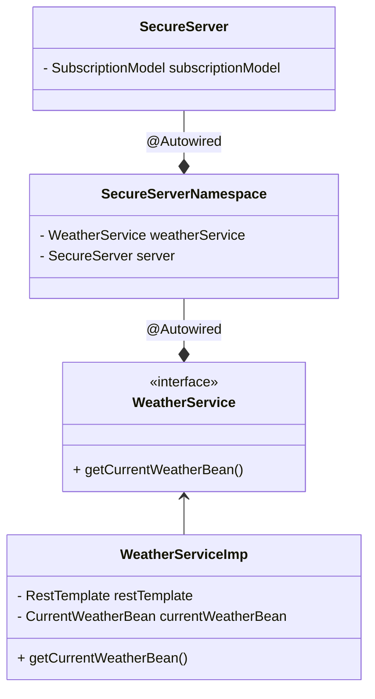

```mermaid
classDiagram
    SecureServer --* SecureServerNamespace : @Autowired
	SecureServerNamespace --* WeatherService : @Autowired
	WeatherService <-- WeatherServiceImp
	class SecureServerNamespace {
		- WeatherService weatherService
		- SecureServer server
	}
	class WeatherService {
		<<interface>> 
		+ getCurrentWeatherBean()
	}
	class WeatherServiceImp {
		- RestTemplate restTemplate
		- CurrentWeatherBean currentWeatherBean
		+ getCurrentWeatherBean()
	}
	class SecureServer {
		- SubscriptionModel subscriptionModel
	}
```